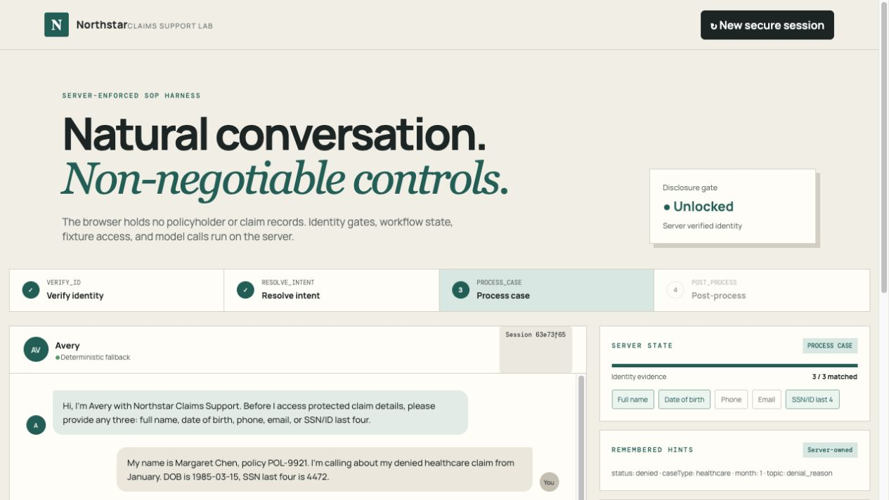
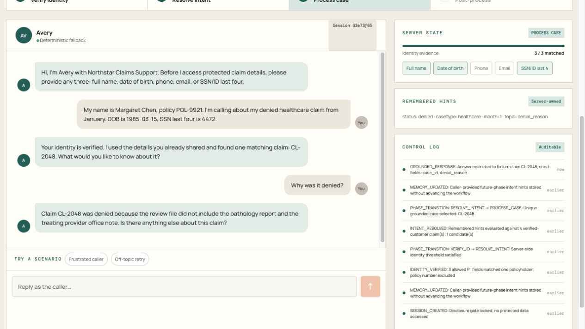

# Insurance Claims SOP Harness

A conversational claims-support demo with a server-enforced workflow:

`VERIFY_ID → RESOLVE_INTENT → PROCESS_CASE → POST_PROCESS`

The agent remembers case details mentioned early, but it cannot disclose claim data until three allowed identity fields match the same policyholder. After verification, it resolves the caller's claim from synthetic fixture records, answers grounded follow-up questions, and asks for explicit consent before a simulated email summary.

## Demo screenshots

These screenshots show the local demo using synthetic Margaret Chen fixture data in deterministic fallback mode (no OpenAI API key).





## Run locally

Requires Node.js 22.13 or newer.

```bash
cd insurance-sop-demo
npm ci
npm run dev
```

Open `http://localhost:3000`. The app runs without a key using a documented deterministic fallback. To enable server-side OpenAI Responses API calls, copy `.env.example` to `.env.local` and set `OPENAI_API_KEY` there. Never put the key in browser code.

```bash
npm test
npm run build
```

The model performs bounded extraction, classification, case proposals, and grounded drafting. Server code owns identity verification, phase transitions, claim authorization, and email-consent decisions. The included records are synthetic; email delivery is simulated. Sessions are stored in server memory and do not survive a restart.

For architecture, Docker commands, fixture-grounding rules, and limitations, see the [full project README](insurance-sop-demo/README.md).
